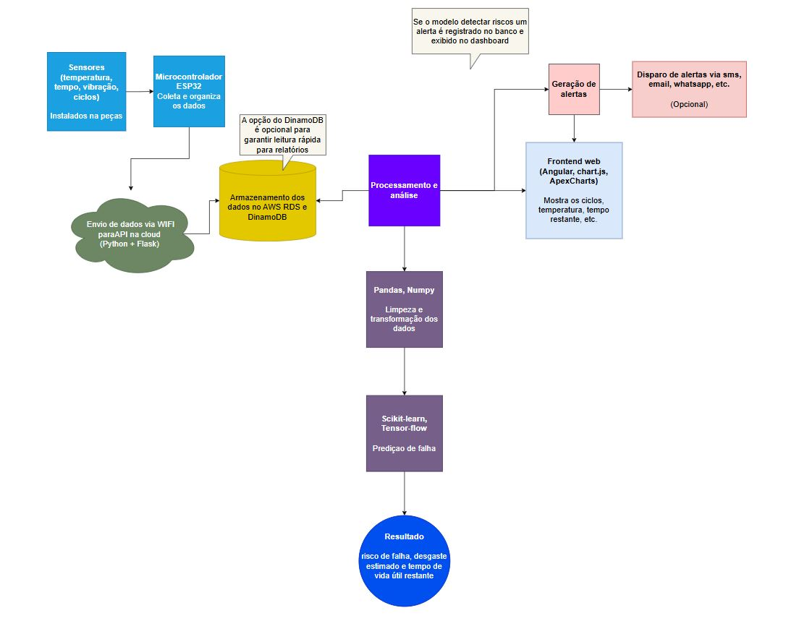

# FIAP - Faculdade de Informática e Administração Paulista 

 

# Nome do projeto

## Nome do grupo

## 👨‍🎓 Integrantes: 
- <a href="https://www.linkedin.com/in/jonastadeufernandes/?locale=en_US">Jonas Tadeu V Fernandes</a>
- <a href="">Levi Passos Silveira Marques</a>
- <a href="">Raphael da Silva</a> 
- <a href="[https://www.linkedin.com/company/inova-fusca](https://www.linkedin.com/in/raphael-dinelli-8a01b278/)">Raphael Dinelli Neto</a>

## 👩‍🏫 Professores:
### Tutor(a) 
- <a href="https://www.linkedin.com/company/inova-fusca">Leonardo Ruiz Orbana</a>
### Coordenador(a)
- <a href="https://www.linkedin.com/company/inova-fusca">André Godoi Chiovato</a>

## 📜 Descrição

# 🚜 Monitoramento de Deterioração e Vida Útil das Peças

Este projeto foi desenvolvido pelo grupo **SP e Interior** como parte do desafio proposto pela empresa **Hermes Reply**, em parceria com a FIAP. A proposta visa aplicar técnicas de **Machine Learning** e **IoT** para prever falhas e estimar a vida útil de componentes mecânicos utilizados em ambientes industriais.

Nosso objetivo é permitir **manutenção preditiva**, minimizando o tempo de máquina parada e reduzindo custos operacionais.

---

## 🎯 Objetivo do Sistema

Estimar a vida útil de peças e componentes com base em:

- Tempo de uso (em horas)
- Número de ciclos de operação (liga/desliga)
- Registro de temperatura durante o funcionamento
- Dados de vibração (opcional)
- Histórico de falhas anteriores

Esses dados serão processados por modelos de Machine Learning que irão prever o risco de falha iminente e gerar alertas automatizados.

---

## 🧠 Tecnologias Utilizadas

| Camada             | Tecnologia                          | Justificativa |
|--------------------|-------------------------------------|---------------|
| **Sensoriamento**  | ESP32                               | Coleta local de tempo, ciclos, temperatura e vibração |
| **Armazenamento**  | AWS RDS (MySQL) ou DynamoDB         | Armazenamento confiável e escalável |
| **Backend**        | Python                              | Processamento dos dados e integração com IA |
| **Machine Learning**| Scikit-learn / TensorFlow          | Modelagem e predição de falhas |
| **Análise de Dados**| Pandas / NumPy                     | Manipulação e análise de dados históricos |
| **Visualização**   | Matplotlib / Seaborn                | Geração de gráficos e dashboards |
| **Nuvem**          | AWS EC2                             | Processamento remoto e simulação de ambiente industrial |

---

## 🔌 Pipeline de Dados

1. **Coleta de Dados (ESP32)**  
   - Tempo de uso
   - Temperatura
   - Ciclos de operação
   - Vibração (opcional)

2. **Envio dos Dados (simulado via script Python)**  
   - Comunicação com o banco de dados

3. **Armazenamento (AWS RDS / DynamoDB)**  
   - Histórico estruturado e seguro

4. **Processamento (EC2)**  
   - Modelos de ML treinados para predição de falhas. A predileção por EC2 ao invés de ambiente local é devido a custos e facilidade de manutenção da infra-estrutura.

5. **Visualização e Alertas**  
   - Dashboards e alertas automatizados com base nas previsões

---

## 🧱 Modelagem de Banco de Dados

### Principais Entidades:

- **PECAS**: id_peca, tipo, fabricante, tempo_uso_total
- **SENSORES**: id_sensor, tipo_sensor, id_peca
- **CICLOS_OPERACAO**: id_ciclo, id_peca, data_inicio, data_fim, duracao
- **LEITURAS_SENSOR**: id_leitura, id_sensor, leitura_valor, leitura_data_hora
- **FALHAS**: id_falha, id_peca, descricao, data
- **ALERTAS**: id_alerta, id_falha, nivel_risco

### Relacionamentos:

- Uma peça possui vários sensores (1:N)
- Uma peça possui vários ciclos de operação (1:N)
- Cada ciclo possui várias leituras (1:N)
- Uma peça pode ter várias falhas (1:N)
- Cada falha pode gerar múltiplos alertas (1:N)

---

## 🖼️ Arquitetura da Solução

A imagem abaixo representa a arquitetura proposta do sistema, integrando sensores, banco de dados e modelos de IA:

---

## 📊 Estratégia de Coleta de Dados

Nesta fase inicial, os dados serão **simulados** por meio de scripts Python que imitam a operação dos sensores conectados a um ESP32. Serão gerados:

- Ciclos de operação aleatórios
- Leituras de temperatura variando com o tempo
- Eventos de falha simulados para treinar o modelo

Em fases futuras, será possível realizar a **integração real com sensores físicos ESP32**, via conexão Wi-Fi e envio dos dados diretamente para o banco na nuvem.

---

## 📆 Plano de Desenvolvimento

1. Simulação dos dados de sensores
2. Modelagem relacional do banco de dados
3. Criação do pipeline de ingestão e armazenamento
4. Desenvolvimento do modelo de IA
5. Criação de dashboards com alertas preditivos
6. Integração final e testes

---

## ✅ Status da Entrega

- ✅ Definição da arquitetura da solução
- ✅ Modelagem inicial do banco de dados
- ✅ Escolha das tecnologias e justificação
- ✅ README documentado
- ✅ Diagrama DER
- ✅ Script SQL inicial com o código de criação das tabelas
- ⬜ Implementação do MVP (futuro)

---

## 📎 Observações

- O repositório é privado e foi compartilhado com os tutores responsáveis.
- Dados utilizados nesta fase são simulados.
- Nenhum código funcional foi exigido nesta etapa, apenas a proposta da arquitetura.

---

## 🔐 Tutores com acesso

- leoruiz197

---

## 🗃 Histórico de lançamentos
* 0.1.0 - 14/05/2025
    *

## 📋 Licença

<a property="dct:title" rel="cc:attributionURL" href="https://github.com/agodoi/template">MODELO GIT FIAP</a> por <a rel="cc:attributionURL dct:creator" property="cc:attributionName" href="https://fiap.com.br">Fiap</a> está licenciado sobre <a href="http://creativecommons.org/licenses/by/4.0/?ref=chooser-v1" target="_blank" rel="license noopener noreferrer" style="display:inline-block;">Attribution 4.0 International</a>.

